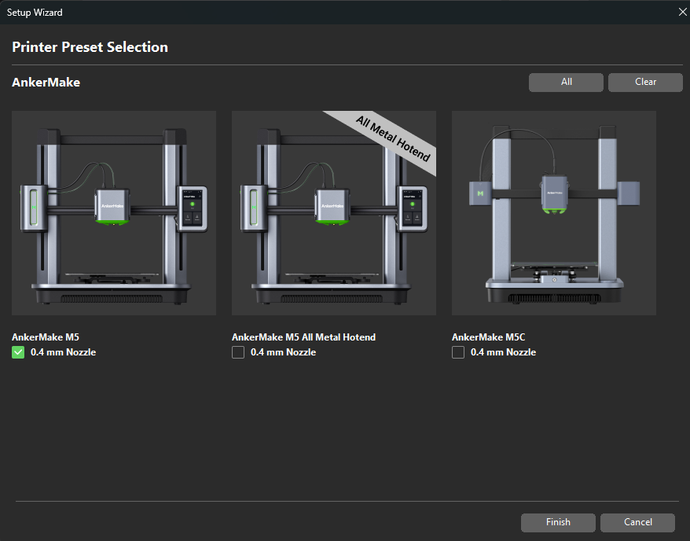

# ankermake-studio

This repository contains details of what I've learned working with AnkerMake Studio (Beta).

# Startup

When first launching AnkerMake Studio, it will ask you to choose a printer:



These choices are controlled via the _Anker.ini_ file where AnkerMake Studio is installed. Typically it's "C:\Users\<your profile name>\AppData\Roaming\AnkerMake Studio Profile\vendor". Here's a sample for the AnkerMake M5:

```
    [printer_model:M5]
    name = AnkerMake M5
    variants = 0.4
    technology = FFF
    family = AnkerMake M5
    bed_model = M5-bed.stl
    bed_texture = M5-texture_m5.svg
    thumbnail = M5.png
    default_materials = PLA+; TPU; PETG; ABS
```
# Base Settings
If the printer choice is an "M5-Variant", inherited settings are called from the _machine base common_ section. Here are some interesting excerpts:

- Size and Coordinates
    - bed shape: 0x0,235x0,235x235,0x235
    - max print height: 250
    - z offset: 0
- Advanced
    - relative e distances: 1
    - firmware retraction: 0
    - use volumetric e: 0
    - variable layer height: 1
- Machine Limits
    - feedrates
    - accelerations
    - jerks
- Extruder
    - size
    - layer height limits
    - retraction

```
        # Custom G-code
                start_gcode = M104 S{first_layer_temperature[0]} ; set final nozzle temp\nM190 S{first_layer_bed_temperature[0]} ; set and wait for bed temp to stabilize\nM109 S{first_layer_temperature[0]} ; wait for nozzle temp to stabilize\nG28 ;Home\n;LAYER_COUNT:{total_layer_count}\n
                autoemit_temperature_commands = 1
                end_gcode = M104 S0\nM140 S0\n;Retract the filament\nG92 E1\nG1 E-1 F300\nG28 X0 Y0\nM84
                before_layer_gcode = ;BEFORE_LAYER_CHANGE\n;{layer_z}\n;LAYER:{layer_num+1}
                layer_gcode = ;AFTER_LAYER_CHANGE\nG92 E0
                toolchange_gcode = 
                between_objects_gcode = 
                color_change_gcode = M600
                pause_print_gcode = M601
                template_custom_gcode = 
```

# Nozzle Settings
Next up, the _Anker.ini_ file goes through nozzle settings for the following types:
- M5 All-Metal Hotend 0.4 mm
- M5 0.4 mm

Note: The M5 0.2 nozzle settings are commented out
```
        #    [printer:AnkerMake M5 0.2 mm Nozzle]
        #        inherits = *M5-Variant*
        #        # variant
        #            extruder_colour = #F1C5CB
        #            printer_variant = 0.2
        #            nozzle_diameter = 0.2
        #            min_layer_height = 0.04
        #            max_layer_height = 0.16
        #        
        #            printer_notes = MACHINE_COMPATIBLE\n MACHINE_M5_\n F_PLA+\n P_PRECISION P_NORMAL P_FAST\n
        #            default_print_profile = M5 0.2mm - PLA+ Basic - NORMAL
        #            default_filament_profile = AnkerMake PLA+ Basic (White)
```

# Filament
## Non-Anker Filament
Non-Anker filament types are next, listing:
- PLA+
- TPU
- ABS
- PETG
- PA-CF
- PLA-CF
- PVA

For each filament type, the settings include:
- filament color (in hex)
- extrusion multiplier
- first layer temperature
- temperature
- first layer bed temperature
- bed temperature
- slowdown below layer time
- filament soluble toggle
- compatible printer condition
- compatible print condition

## Anker Filament
These list all the Anker filament choices in AnkerMake Studio and filament type settings
- AnkerMake PLA+ Basic
- AnkerMake PLA+ Basic (Black)